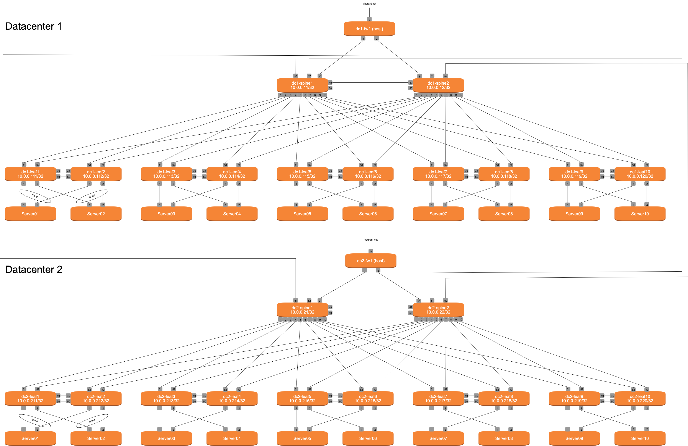

# NA Vagrant
De vagrant omgeving ziet er alsvolgt uit:

Volg de volgende stappen om de vagrant file te genereren:

1. Clone de volgende cumulus repo naar de server waar je de vagrant demo op gaat starten:
git clone https://gitlab.com/cumulus-consulting/tools/topology_converter.git

2. Clone de NA-Vagrant repo naar de server waar je de vagrant demo op gaat starten:
git clone https://github.com/Falco-networks/na-vagrant.git

Je zal nu de volgende 2 folder zien: 
Patricks-Work-MacBook-Pro:demo patrick$ ls
na-vagrant		topology_converter

3. cd naar de na vagrant folder:
cd na-vagrant

Je zal nu de volgende inhoud zien:
Patricks-Work-MacBook-Pro:na-vagrant patrick$ ls
README.md	ansible-scripts	helper_scripts	na.dot

De na.dot file beschrijft de omgeving zoals aangemaakt moet gaan worden in vagrant. Hier in staan de nodes die aangemaakt moeten worden en hoe deze onderling met elkaar verbonden zijn. Verder staat hier voor sommmige nodes (hosts) nog een script wat start tijdens de eerste keer booten om een aantal zaken uit te voeren voor vagrant en verbinding met het oob-mgmt netwerk.

4. Installeer de volgende python requirements:
sudo apt install python3-pip
sudo pip3 install --upgrade pip
sudo pip3 install setuptools
sudo pip3 install pydotplus
sudo pip3 install jinja2
sudo pip3 install ipaddress

Na het installeren van de python requirements kan je de topology converter van Cumulus gebruiken om de vagrantfile te genereren.

5. Voer het volgende commando uit om de Vagrantfile te maken
python3 ../topology_converter/topology_converter.py na.dot -c -p libvirt

De -c in het bovenstaande commando geeft aan om automatische een oob-mgmt netwerk te genereren. De -p geeft aan welke virtualisatie provider gebruikt moet worden. In dit geval is dat libvirt/kvm maar je kan hier ook virtualbox opgeven om het lokaal op je computer te kunnen runnen.

Voor het uitvoeren van de na-demo omgeving zonder netq heb je minimaal 31232 MB aan ram nodig

Na het uitvoeren van het script zie je de volgende folders:
patrick@cumulus-demo:~/demo/na-vagrant$ ls -l
total 380
drwxrwxr-x 2 patrick patrick   4096 Jan 23 09:50 ansible-scripts
-rw-rw-r-- 1 patrick patrick  11155 Jan 23 09:50 dhcp_mac_map
drwxrwxr-x 3 patrick patrick   4096 Jan 23 09:50 helper_scripts
-rw-rw-r-- 1 patrick patrick   9277 Jan 23 09:50 na.dot
-rw-rw-r-- 1 patrick patrick     33 Jan 23 09:50 README.md
-rw-rw-r-- 1 patrick patrick 350601 Jan 23 09:50 Vagrantfile

6. Controleer of de vagrantfile leesbaar is voor vagrant
sudo vagrant status

Na bovenstaande commando zou je de volgende output moeten zien:
patrick@cumulus-demo:~/demo/na-vagrant$ sudo vagrant status
Current machine states:

oob-mgmt-server           not created (libvirt)
oob-mgmt-switch           not created (libvirt)
dc1-spine1                not created (libvirt)
dc2-spine1                not created (libvirt)
dc2-spine2                not created (libvirt)
dc1-spine2                not created (libvirt)
dc1-leaf10                not created (libvirt)
dc1-leaf7                 not created (libvirt)
dc2-leaf3                 not created (libvirt)
dc1-leaf3                 not created (libvirt)
dc2-leaf7                 not created (libvirt)
dc1-leaf5                 not created (libvirt)
dc2-leaf10                not created (libvirt)
dc1-leaf9                 not created (libvirt)
dc2-leaf1                 not created (libvirt)
dc1-leaf4                 not created (libvirt)
dc2-leaf8                 not created (libvirt)
dc1-leaf2                 not created (libvirt)
dc2-leaf4                 not created (libvirt)
dc1-leaf6                 not created (libvirt)
dc2-leaf9                 not created (libvirt)
dc2-leaf6                 not created (libvirt)
dc2-leaf2                 not created (libvirt)
dc1-leaf1                 not created (libvirt)
dc1-leaf8                 not created (libvirt)
dc2-leaf5                 not created (libvirt)
dc1-server2               not created (libvirt)
dc2-server6               not created (libvirt)
dc1-server8               not created (libvirt)
dc2-server1               not created (libvirt)
dc2-server4               not created (libvirt)
dc2-server10              not created (libvirt)
dc1-server1               not created (libvirt)
dc2-server3               not created (libvirt)
dc2-server5               not created (libvirt)
dc1-server4               not created (libvirt)
dc2-server9               not created (libvirt)
dc2-server2               not created (libvirt)
dc1-server6               not created (libvirt)
dc1-server7               not created (libvirt)
dc1-server3               not created (libvirt)
dc1-server10              not created (libvirt)
dc1-fw1                   not created (libvirt)
dc2-fw1                   not created (libvirt)
dc1-server5               not created (libvirt)
dc2-server7               not created (libvirt)
dc2-server8               not created (libvirt)
dc1-server9               not created (libvirt)

6. Opspinnen omgeving
Voor het gebruik gaan maken van de omgeving heb je altijd de oob-mgmt-server en oob-mgmt-switch nodig. Deze kan je opspinnen door het volgende commando te doen:
sudo vagrant up /oob/

Hierna kan je verschillende nodes starten op de volgende manieren:

1 node staren:
sudo vagrant up node-name
Bijvoorbeeld:
sudo vagrant up dc1-leaf1

meerdere nodes starten:
sudo vagrant up node1 node2 node3
Bijvoorbeeld
sudo vagrant up dc1-leaf1 dc1-leaf2 dc1-spine1

1 datacenter starten:
sudo vagrant up /dc1/

Alles starten:
sudo vagrant up

